# Database Schema — FaceVoting

**Database**: `evoting`  
**Engine**: InnoDB  
**Charset**: utf8mb4 / utf8mb4_general_ci  
**Server**: MariaDB 10.4 (MySQL-compatible)  
**Dump date**: 2021-07-20  
**Analyzed**: 2026-06-06

---

## Table of Contents

1. [Mermaid ERD](#mermaid-erd)
2. [Table: admin](#table-admin)
3. [Table: token](#table-token)
4. [Table: user](#table-user)
5. [Table: detail\_user](#table-detail_user)
6. [Table: album](#table-album)
7. [Table: photo](#table-photo)
8. [Table: pencocokan](#table-pencocokan)
9. [Table: kategori](#table-kategori)
10. [Table: paslon](#table-paslon)
11. [Table: detail\_paslon](#table-detail_paslon)
12. [Table: otorisasi\_pemilih](#table-otorisasi_pemilih)
13. [Table: voting](#table-voting)
14. [Table: tbjurusan](#table-tbjurusan)
15. [Relationship Summary](#relationship-summary)
16. [Model Usage Matrix](#model-usage-matrix)
17. [Schema Issues & Anomalies](#schema-issues--anomalies)

---

## Mermaid ERD

```mermaid
erDiagram

    admin {
        int     id_admin     PK  "AUTO_INCREMENT"
        varchar username         "NOT NULL, max 30"
        varchar password         "NOT NULL, bcrypt, max 255"
        int     status           "NOT NULL, 1=active"
    }

    token {
        int     id_token     PK  "AUTO_INCREMENT"
        int     id_admin     FK  "NOT NULL"
        varchar token            "NOT NULL, SHA1 hex, max 100"
        int     time             "NOT NULL, Unix timestamp"
    }

    user {
        int      id_user        PK  "AUTO_INCREMENT"
        varchar  email              "NOT NULL, max 100"
        varchar  password           "NOT NULL, SHA1, max 100"
        varchar  token_firebase     "NULL, FCM token, max 255"
        varchar  token_login        "NULL, 10-char alphanum, max 100"
        varchar  entry_id           "NOT NULL, Lambda face ID, max 255"
        tinyint  status             "NOT NULL, 1=active 2=pending"
    }

    detail_user {
        int     id_detail    PK  "AUTO_INCREMENT"
        int     id_user      FK  "NOT NULL"
        varchar nama             "NOT NULL, full name, max 100"
        varchar identitas        "NOT NULL, student/citizen ID, max 50"
    }

    album {
        int     id_album     PK  "AUTO_INCREMENT"
        varchar nama_album       "NOT NULL, max 255"
        varchar kode_album       "NOT NULL, Lambda album hash, max 255"
    }

    photo {
        int     id_photo     PK  "AUTO_INCREMENT"
        int     id_album     FK  "NOT NULL"
        int     id_user      FK  "NOT NULL"
        varchar entry_id         "NOT NULL, Lambda face tag, max 100"
        varchar nama_photo       "NOT NULL, filename stem, max 100"
        varchar gambar           "NOT NULL, filename with ext, max 128"
        int     status_train     "NOT NULL, 0=untrained 1=trained"
    }

    pencocokan {
        int     id_pencocokan  PK  "AUTO_INCREMENT"
        int     id_user            "NOT NULL, no FK constraint"
        varchar nama_photo         "NOT NULL, filename stem, max 100"
        varchar gambar             "NOT NULL, filename with ext, max 128"
        varchar score              "NOT NULL, FaceXAPI similarity, max 10"
    }

    kategori {
        int     id_kategori      PK  "AUTO_INCREMENT"
        varchar nama_kategori        "NOT NULL, max 80"
        varchar logo_kategori        "NOT NULL, filename in gambar/, max 100"
        int     status_kategori      "NOT NULL, 1=setup 2=voting-open"
    }

    paslon {
        int     id_paslon      PK  "AUTO_INCREMENT"
        int     id_kategori    FK  "NOT NULL"
        varchar judul_paslon       "NOT NULL, label e.g. Paslon 1, max 20"
        varchar ketua_paslon       "NOT NULL, leader name, max 50"
        varchar wakil_paslon       "NOT NULL, deputy name, max 50"
        varchar photo1_paslon      "NULL, leader photo filename, max 100"
        varchar photo2_paslon      "NULL, deputy photo filename, max 100"
        int     perolehan          "NULL, vote count"
    }

    detail_paslon {
        int     id_detailpaslon  PK  "AUTO_INCREMENT"
        int     id_paslon        FK  "NOT NULL"
        text    visi_misi            "NOT NULL, vision and mission"
        text    profil_catum         "NOT NULL, leader biography"
        text    profil_cawatum       "NOT NULL, deputy biography"
    }

    otorisasi_pemilih {
        int     id_otorisasi  PK  "AUTO_INCREMENT"
        int     id_user       FK  "NULL"
        int     id_kategori   FK  "NULL"
        int     status            "NULL, 1=authorized 2=voted"
    }

    voting {
        int      id_voting      PK  "AUTO_INCREMENT"
        int      id_user        FK  "NOT NULL"
        int      id_kategori    FK  "NOT NULL"
        int      id_paslon      FK  "NOT NULL"
        datetime tanggal_voting     "NULL, vote timestamp"
    }

    tbjurusan {
        int     id_jurusan    PK  "AUTO_INCREMENT"
        varchar kode_jurusan      "NOT NULL, max 50"
        varchar nama_jurusan      "NOT NULL, max 100"
    }

    %% Relationships
    admin          ||--o{ token              : "issues"
    user           ||--||  detail_user       : "has profile"
    user           ||--o{ photo              : "enrolls face"
    user           ||--o{ otorisasi_pemilih  : "authorized in"
    user           ||--o{ voting             : "submits"
    user           ||--o{ pencocokan         : "verified by"
    album          ||--o{ photo              : "groups"
    kategori       ||--o{ paslon             : "contains"
    kategori       ||--o{ otorisasi_pemilih  : "governs"
    kategori       ||--o{ voting             : "records"
    paslon         ||--||  detail_paslon     : "has detail"
    paslon         ||--o{ voting             : "receives"
```

---

## Table: `admin`

**Purpose**: Stores the single administrator account used to access the web admin panel.

### Columns

| Column | Data Type | Nullable | Default | Extra | Description |
|---|---|---|---|---|---|
| `id_admin` | `int(11)` | NO | — | AUTO_INCREMENT | Primary key |
| `username` | `varchar(30)` | NO | — | — | Login username |
| `password` | `varchar(255)` | NO | — | — | Password hash (PASSWORD_BCRYPT) |
| `status` | `int(11)` | NO | — | — | Account state; `1` = active |

### Indexes

| Name | Type | Columns |
|---|---|---|
| `PRIMARY` | PRIMARY KEY | `id_admin` |

### Foreign Keys

None.

### Seed Data

| id_admin | username | password | status |
|---|---|---|---|
| 1 | `admin` | `$2y$10$lqkCunzV…` (bcrypt of `admin`) | 1 |

### Model Usage

| Method | Model | Operation |
|---|---|---|
| `validasi_login($username)` | `Admin_m` | SELECT WHERE username |
| `update_admin($data)` | `Admin_m` | UPDATE WHERE id_admin = 1 (hardcoded) |

### Notes

- Only one admin row exists by design. `update_admin()` hardcodes `WHERE id_admin = 1`.
- Password hashed with bcrypt (`password_hash()` / `PASSWORD_BCRYPT`). Verified with `password_verify()` in `Login` controller.

---

## Table: `token`

**Purpose**: Server-side session store for admin login sessions. Each login generates a new token row; logout deletes it. Acts as the server-side half of the session, preventing session fixation.

### Columns

| Column | Data Type | Nullable | Default | Extra | Description |
|---|---|---|---|---|---|
| `id_token` | `int(11)` | NO | — | AUTO_INCREMENT | Primary key |
| `id_admin` | `int(11)` | NO | — | — | FK → `admin.id_admin` |
| `token` | `varchar(100)` | NO | — | — | SHA1 hex string (`sha1(username . password . microtime())`) |
| `time` | `int(11)` | NO | — | — | Unix timestamp of login moment |

### Indexes

| Name | Type | Columns |
|---|---|---|
| `PRIMARY` | PRIMARY KEY | `id_token` |
| `token_ibfk_1` | INDEX | `id_admin` |

### Foreign Keys

| Constraint | Column | References | On Delete | On Update |
|---|---|---|---|---|
| `token_ibfk_1` | `id_admin` | `admin(id_admin)` | CASCADE | NO ACTION |

### Model Usage

| Method | Model | Operation |
|---|---|---|
| `get_token_byId($id)` | `Admin_m` | SELECT WHERE id_admin |
| `cek_token($username)` | `Admin_m` | SELECT (JOIN admin) WHERE username → num_rows |
| `hapus_token($idUser)` | `Admin_m` | DELETE WHERE id_admin |
| `simpan_token($data)` | `Admin_m` | INSERT |

### Notes

- `time` is stored but **never compared** for expiry in any controller — effectively unlimited session lifetime until explicit logout.
- Token collision is not guarded against; `microtime()` provides sufficient entropy in practice but is not cryptographically secure.

---

## Table: `user`

**Purpose**: Voter accounts registered via the mobile app. Contains credentials, session state, and the Lambda face recognition `entry_id`.

### Columns

| Column | Data Type | Nullable | Default | Extra | Description |
|---|---|---|---|---|---|
| `id_user` | `int(11)` | NO | — | AUTO_INCREMENT | Primary key |
| `email` | `varchar(100)` | NO | — | — | Login email address |
| `password` | `varchar(100)` | NO | — | — | SHA1 hash of password |
| `token_firebase` | `varchar(255)` | YES | NULL | — | Firebase Cloud Messaging device token |
| `token_login` | `varchar(100)` | YES | NULL | — | Current API session token (10-char alphanum) |
| `entry_id` | `varchar(255)` | NO | — | — | Unique identifier used as face tag in Lambda album |
| `status` | `tinyint(4)` | NO | — | — | `1` = active, `2` = pending admin activation |

### Indexes

| Name | Type | Columns |
|---|---|---|
| `PRIMARY` | PRIMARY KEY | `id_user` |

### Foreign Keys

None on this table (other tables reference it).

### Model Usage

| Method | Model | Operation |
|---|---|---|
| `cekEmail($email)` | `Api_model` | SELECT (JOIN detail_user) WHERE email |
| `simpan_data_user($data)` | `Api_model` | INSERT → returns insert_id |
| `validasi_login($email, $pass)` | `Api_model` | SELECT WHERE email AND password |
| `simpan_token_login($data, $id)` | `Api_model` | UPDATE WHERE id_user |
| `get_data_user($id)` | `Api_model` | SELECT WHERE id_user |
| `get_data_akun($id)` | `Api_model` | SELECT (JOIN detail_user) WHERE id_user |
| `update_password($data, $id)` | `Api_model` | UPDATE WHERE id_user |
| `get_data_user($data)` | `Admin_m` | SELECT (JOIN detail_user) optionally WHERE id_user AND status=2 |
| `get_data_user2($data)` | `Admin_m` | SELECT WHERE id_user |
| `aktivasi_user($data, $id)` | `Admin_m` | UPDATE WHERE id_user |
| `hapus_user($id)` | `Admin_m` | DELETE WHERE id_user |

### Notes

- `password` uses **SHA1** (deprecated, cryptographically broken). Should be migrated to bcrypt.
- `email` has no UNIQUE constraint in the schema — uniqueness is enforced only by `cekEmail()` check in the API controller.
- `token_login` is replaced on every login, so sessions are effectively single-device.
- `entry_id` is a random alphanumeric string generated at registration, used as the `tag` parameter in Lambda API calls.

---

## Table: `detail_user`

**Purpose**: Extended voter profile (name and identity number). Split from `user` for normalization. One-to-one with `user`.

### Columns

| Column | Data Type | Nullable | Default | Extra | Description |
|---|---|---|---|---|---|
| `id_detail` | `int(11)` | NO | — | AUTO_INCREMENT | Primary key |
| `id_user` | `int(11)` | NO | — | — | FK → `user.id_user` |
| `nama` | `varchar(100)` | NO | — | — | Full name |
| `identitas` | `varchar(50)` | NO | — | — | Identity / student number (NIM, KTP, etc.) |

### Indexes

| Name | Type | Columns |
|---|---|---|
| `PRIMARY` | PRIMARY KEY | `id_detail` |
| `id_user` | INDEX | `id_user` |

### Foreign Keys

| Constraint | Column | References | On Delete | On Update |
|---|---|---|---|---|
| `detail_user_ibfk_1` | `id_user` | `user(id_user)` | CASCADE | NO ACTION |

### Model Usage

| Method | Model | Operation |
|---|---|---|
| `simpan_data_detail($data)` | `Api_model` | INSERT |
| `update_detail_user($data, $id)` | `Api_model` | UPDATE WHERE id_user |
| `get_data_akun($id)` | `Api_model` | JOIN source in SELECT |
| `get_data_user($data)` | `Admin_m` | JOIN source in SELECT |
| `get_data_pemilih($data)` | `Admin_m` | LEFT JOIN source in SELECT |
| `get_data_calon($data)` | `Admin_m` | JOIN source in SELECT |
| `get_data_photo()` | `Admin_m` | JOIN source in SELECT |

### Notes

- Cascade delete means removing a `user` row automatically removes their `detail_user` row.
- One row per user; no UNIQUE constraint on `id_user` in schema (enforced implicitly by single-insert pattern).

---

## Table: `album`

**Purpose**: Stores Lambda Face Recognition album configurations. Each album has a unique `kode_album` (a hash used as the identifier in all Lambda API calls). The application uses a single shared album for all voters.

### Columns

| Column | Data Type | Nullable | Default | Extra | Description |
|---|---|---|---|---|---|
| `id_album` | `int(11)` | NO | — | AUTO_INCREMENT | Primary key |
| `nama_album` | `varchar(255)` | NO | — | — | Human-readable album name |
| `kode_album` | `varchar(255)` | NO | — | — | Lambda API album hash identifier |

### Indexes

| Name | Type | Columns |
|---|---|---|
| `PRIMARY` | PRIMARY KEY | `id_album` |

### Foreign Keys

None.

### Seed Data

| id_album | nama_album | kode_album |
|---|---|---|
| 3 | `Facevoting2021` | `859d15e7156ef8128f921671b6a3d941…` |

### Model Usage

| Method | Model | Operation |
|---|---|---|
| `get_data_album($data)` | `Admin_m` | SELECT (broken JOIN — see anomalies) |
| `data_album($id)` | `Admin_m` | SELECT WHERE id_album |
| `simpan_album($data)` | `Admin_m` | INSERT |
| `get_data_album($id)` | `Api_model` | SELECT WHERE id_album |
| `get_data_photo()` | `Admin_m` | JOIN source in SELECT |
| `data_photo($id)` | `Admin_m` | JOIN source in SELECT |

### Notes

- `AUTO_INCREMENT` starts at 4, indicating rows 1–2 were created and deleted during development.
- **Anomaly**: `Admin_m::get_data_album()` performs `JOIN detail_user ON detail_user.id_user = album.id_user`, but `album` has no `id_user` column. This query will produce a MySQL error at runtime.

---

## Table: `photo`

**Purpose**: Training face photos uploaded by voters. Each row links a stored image file to a voter (`id_user`), a face recognition album (`id_album`), and its Lambda API training status.

### Columns

| Column | Data Type | Nullable | Default | Extra | Description |
|---|---|---|---|---|---|
| `id_photo` | `int(11)` | NO | — | AUTO_INCREMENT | Primary key |
| `id_album` | `int(11)` | NO | — | — | Album this photo is indexed in |
| `id_user` | `int(11)` | NO | — | — | FK → `user.id_user` |
| `entry_id` | `varchar(100)` | NO | — | — | Lambda face tag (mirrors `user.entry_id`) |
| `nama_photo` | `varchar(100)` | NO | — | — | Filename stem (10-char hex, no extension) |
| `gambar` | `varchar(128)` | NO | — | — | Full filename with extension (e.g., `b6a0595f28.jpg`) |
| `status_train` | `int(11)` | NO | — | — | `0` = not trained, `1` = trained in Lambda |

### Indexes

| Name | Type | Columns |
|---|---|---|
| `PRIMARY` | PRIMARY KEY | `id_photo` |
| `id_user` | INDEX | `id_user` |

### Foreign Keys

| Constraint | Column | References | On Delete | On Update |
|---|---|---|---|---|
| `photo_ibfk_1` | `id_user` | `user(id_user)` | CASCADE | NO ACTION |

### Model Usage

| Method | Model | Operation |
|---|---|---|
| `simpan_photo($data)` | `Api_model` | INSERT |
| `get_data_photo($id)` | `Api_model` | SELECT WHERE id_user |
| `get_data_photo()` | `Admin_m` | SELECT (JOIN album, JOIN detail_user) ORDER BY status_train DESC |
| `data_photo($id)` | `Admin_m` | SELECT (JOIN album) WHERE id_photo |
| `hapus_photo($id)` | `Admin_m` | DELETE WHERE id_photo |

### Notes

- `id_album` has no FK constraint in the schema (only `id_user` is constrained). An orphaned `id_album` value will not trigger a database error.
- `AUTO_INCREMENT=32` indicates 31 rows were inserted historically; the table is empty in the dump.
- Files are stored at `gambar/user/<gambar>` on the local filesystem. Deleting the database row does **not** delete the file.
- `entry_id` in `photo` should always equal `user.entry_id` for the same voter; no constraint enforces this.

---

## Table: `pencocokan`

**Purpose**: Audit log of every face verification attempt at voting time. Each row records the uploaded verification image and the similarity score returned by FaceXAPI.

### Columns

| Column | Data Type | Nullable | Default | Extra | Description |
|---|---|---|---|---|---|
| `id_pencocokan` | `int(11)` | NO | — | AUTO_INCREMENT | Primary key |
| `id_user` | `int(11)` | NO | — | — | Voter (no FK constraint) |
| `nama_photo` | `varchar(100)` | NO | — | — | Verification filename stem |
| `gambar` | `varchar(128)` | NO | — | — | Verification filename with extension |
| `score` | `varchar(10)` | NO | — | — | FaceXAPI similarity score (stored as string) |

### Indexes

| Name | Type | Columns |
|---|---|---|
| `PRIMARY` | PRIMARY KEY | `id_pencocokan` |

### Foreign Keys

None (no FK constraint on `id_user` despite referencing `user.id_user`).

### Model Usage

| Method | Model | Operation |
|---|---|---|
| `simpan_pencocokan($data)` | `Api_model` | INSERT |

No read methods exist — this table is write-only from the application's perspective (admin would need direct DB access to review it).

### Notes

- `score` is `varchar(10)`, not numeric. FaceXAPI returns a decimal between 0 and 1; storing as string limits aggregation queries.
- Seed data shows 3 rows with empty `score` (`''`), confirming the FaceXAPI call may return an empty score on failure.
- **No FK on `id_user`**: deleting a voter will leave orphaned rows in this table.

---

## Table: `kategori`

**Purpose**: Voting categories (elections), e.g., BEM, HIMKRIS, UKM. Each category has its own set of candidates and authorized voters, and a lifecycle status.

### Columns

| Column | Data Type | Nullable | Default | Extra | Description |
|---|---|---|---|---|---|
| `id_kategori` | `int(11)` | NO | — | AUTO_INCREMENT | Primary key |
| `nama_kategori` | `varchar(80)` | NO | — | — | Display name of the election |
| `logo_kategori` | `varchar(100)` | NO | — | — | Logo filename stored in `gambar/` |
| `status_kategori` | `int(11)` | NO | — | — | See status enum below |

**`status_kategori` enum** (the SQL comment says 1=open, 2=closed, 3=unavailable, but controller logic inverts 1 and 2):

| Value | SQL Comment | Controller Semantics |
|---|---|---|
| `1` | open | `Tutup()` sets this → voting closed / setup mode |
| `2` | ditutup (closed) | `Buka()` sets this → voting open (API `semua_get` returns these) |
| `3` | tidak tersedia (unavailable) | Not used by any active controller |

> **Warning**: The SQL column comment contradicts the controller behavior. `Buka()` (Open) sets `status_kategori = 2` and `Tutup()` (Close) sets it to `1`. The API `semua_get` returns rows `WHERE status_kategori = 2`, confirming `2` means voting is active.

### Indexes

| Name | Type | Columns |
|---|---|---|
| `PRIMARY` | PRIMARY KEY | `id_kategori` |

### Foreign Keys

None on this table (other tables reference it).

### Model Usage

| Method | Model | Operation |
|---|---|---|
| `get_data_kategori($id)` | `Admin_m` | SELECT, optionally WHERE id_kategori |
| `simpan_kategori($data)` | `Admin_m` | INSERT |
| `update_kategori($data, $id)` | `Admin_m` | UPDATE WHERE id_kategori |
| `get_data_kategori_paslon()` | `Admin_m` | SELECT WHERE status_kategori = 1 |
| `get_data_otorisasi($id)` | `Api_model` | JOIN source in SELECT |
| `get_data_kategori_hasil()` | `Api_model` | SELECT WHERE status_kategori = 2 |
| `get_data_voting($idUser)` | `Api_model` | JOIN source in SELECT |

---

## Table: `paslon`

**Purpose**: Candidate pairs (pasangan calon) competing in a voting category. Each pair has two candidates (leader + deputy), two photos, and an incrementing vote counter.

### Columns

| Column | Data Type | Nullable | Default | Extra | Description |
|---|---|---|---|---|---|
| `id_paslon` | `int(11)` | NO | — | AUTO_INCREMENT | Primary key |
| `id_kategori` | `int(11)` | NO | — | — | FK → `kategori.id_kategori` |
| `judul_paslon` | `varchar(20)` | NO | — | — | Pair label (e.g., `Paslon 1`) |
| `ketua_paslon` | `varchar(50)` | NO | — | — | Leader (candidate chairman) name |
| `wakil_paslon` | `varchar(50)` | NO | — | — | Deputy leader name |
| `photo1_paslon` | `varchar(100)` | YES | NULL | — | Leader photo filename in `gambar/` |
| `photo2_paslon` | `varchar(100)` | YES | NULL | — | Deputy photo filename in `gambar/` |
| `perolehan` | `int(11)` | YES | NULL | — | Current vote count (incremented on each vote) |

### Indexes

| Name | Type | Columns |
|---|---|---|
| `PRIMARY` | PRIMARY KEY | `id_paslon` |
| `id_kategori` | INDEX | `id_kategori` |

### Foreign Keys

| Constraint | Column | References | On Delete | On Update |
|---|---|---|---|---|
| `paslon_ibfk_1` | `id_kategori` | `kategori(id_kategori)` | *(not specified)* | *(not specified)* |

> **Note**: `paslon_ibfk_1` has no explicit `ON DELETE` / `ON UPDATE` action, so the database defaults apply: `ON DELETE RESTRICT ON UPDATE RESTRICT`. This means a `kategori` row **cannot be deleted** while any `paslon` rows reference it.

### Model Usage

| Method | Model | Operation |
|---|---|---|
| `get_data_paslon()` | `Admin_m` | SELECT (JOIN kategori, JOIN detail_paslon) |
| `get_data_paslon2()` | `Admin_m` | SELECT (JOIN kategori, JOIN detail_paslon) ORDER BY perolehan DESC |
| `get_data_paslon_byKategori($id)` | `Admin_m` | SELECT WHERE id_kategori |
| `cek_paslon($id)` | `Admin_m` | SELECT WHERE id_paslon |
| `simpan_paslon($data)` | `Admin_m` | INSERT → returns insert_id |
| `hapus_paslon($id)` | `Admin_m` | DELETE WHERE id_paslon |
| `get_data_paslon($id)` | `Api_model` | SELECT (JOIN detail_paslon) WHERE id_kategori |
| `get_data_paslon2($id)` | `Api_model` | SELECT WHERE id_paslon |
| `perbaharui_paslon($data, $id)` | `Api_model` | UPDATE WHERE id_paslon (increments perolehan) |
| `get_data_perolehan($idKategori)` | `Api_model` | SELECT WHERE id_kategori |

### Notes

- `perolehan` is a denormalized counter. It is incremented via `perbaharui_paslon()` at vote submission. The `voting` table is the normalized source of truth; `perolehan` could theoretically diverge if a transaction fails mid-way.
- Photo files in `gambar/` are not deleted when `hapus_paslon()` is called.

---

## Table: `detail_paslon`

**Purpose**: Extended profile content for each candidate pair: vision/mission statement and individual biographies. One-to-one with `paslon`.

### Columns

| Column | Data Type | Nullable | Default | Extra | Description |
|---|---|---|---|---|---|
| `id_detailpaslon` | `int(11)` | NO | — | AUTO_INCREMENT | Primary key |
| `id_paslon` | `int(11)` | NO | — | — | FK → `paslon.id_paslon` |
| `visi_misi` | `text` | NO | — | — | Vision and mission statement |
| `profil_catum` | `text` | NO | — | — | Candidate (leader) biography |
| `profil_cawatum` | `text` | NO | — | — | Deputy candidate biography |

### Indexes

| Name | Type | Columns |
|---|---|---|
| `PRIMARY` | PRIMARY KEY | `id_detailpaslon` |
| `id_paslon` | INDEX | `id_paslon` |

### Foreign Keys

| Constraint | Column | References | On Delete | On Update |
|---|---|---|---|---|
| `detail_paslon_ibfk_1` | `id_paslon` | `paslon(id_paslon)` | CASCADE | NO ACTION |

### Model Usage

| Method | Model | Operation |
|---|---|---|
| `simpan_detail_paslon($data)` | `Admin_m` | INSERT |
| `get_data_paslon()` | `Admin_m` | JOIN source in SELECT |
| `get_data_paslon2()` | `Admin_m` | JOIN source in SELECT |
| `get_data_paslon($id)` | `Api_model` | JOIN source in SELECT |
| `get_detail_paslon($id)` | `Api_model` | SELECT (JOIN paslon) WHERE id_paslon |

### Notes

- Cascade delete: removing a `paslon` row automatically removes the matching `detail_paslon` row.
- There is no UPDATE method for `detail_paslon` in either model — admin cannot edit a candidate's profile after creation without direct DB access.

---

## Table: `otorisasi_pemilih`

**Purpose**: Voter authorization junction table. Each row authorizes a specific voter (`id_user`) to vote in a specific election (`id_kategori`). The `status` column tracks whether that vote has been cast.

### Columns

| Column | Data Type | Nullable | Default | Extra | Description |
|---|---|---|---|---|---|
| `id_otorisasi` | `int(11)` | NO | — | AUTO_INCREMENT | Primary key |
| `id_user` | `int(11)` | YES | NULL | — | FK → `user.id_user` |
| `id_kategori` | `int(11)` | YES | NULL | — | FK → `kategori.id_kategori` |
| `status` | `int(11)` | YES | NULL | — | `1` = authorized, not voted; `2` = voted |

### Indexes

| Name | Type | Columns |
|---|---|---|
| `PRIMARY` | PRIMARY KEY | `id_otorisasi` |
| `id_user` | INDEX | `id_user` |
| `id_kategori` | INDEX | `id_kategori` |

### Foreign Keys

| Constraint | Column | References | On Delete | On Update |
|---|---|---|---|---|
| `otorisasi_pemilih_ibfk_1` | `id_user` | `user(id_user)` | CASCADE | NO ACTION |
| `otorisasi_pemilih_ibfk_2` | `id_kategori` | `kategori(id_kategori)` | CASCADE | NO ACTION |

### Model Usage

| Method | Model | Operation |
|---|---|---|
| `simpan_otorisasi($data)` | `Admin_m` | INSERT |
| `get_data_pemilih($id)` | `Admin_m` | SELECT (LEFT JOIN detail_user) WHERE id_kategori |
| `get_data_calon($id)` | `Admin_m` | Subquery: users NOT IN otorisasi_pemilih for category |
| `get_data_otorisasi($id)` | `Api_model` | SELECT (JOIN kategori) WHERE id_user AND status=1 |
| `perbaharui_data_otorisasi($data,$id)` | `Api_model` | UPDATE WHERE id_user (sets status=2) |

### Notes

- FK columns (`id_user`, `id_kategori`) are **nullable** in the schema even though FK constraints exist — this is unusual and potentially inconsistent.
- No UNIQUE constraint on `(id_user, id_kategori)` — duplicate authorization rows are possible at the database level (prevented only by application logic).
- `perbaharui_data_otorisasi()` uses `WHERE id_user` only (not `AND id_kategori`). If a user is authorized in multiple categories and votes in one, **all** their authorization rows would be set to `status=2` — this is a critical bug.

---

## Table: `voting`

**Purpose**: Immutable audit log of all cast votes. Each row represents one vote by one user for one candidate pair in one election. The normalized source of truth for vote counts.

### Columns

| Column | Data Type | Nullable | Default | Extra | Description |
|---|---|---|---|---|---|
| `id_voting` | `int(11)` | NO | — | AUTO_INCREMENT | Primary key |
| `id_user` | `int(11)` | NO | — | — | FK → `user.id_user` |
| `id_kategori` | `int(11)` | NO | — | — | FK → `kategori.id_kategori` |
| `id_paslon` | `int(11)` | NO | — | — | FK → `paslon.id_paslon` |
| `tanggal_voting` | `datetime` | YES | NULL | — | Timestamp when vote was submitted |

### Indexes

| Name | Type | Columns |
|---|---|---|
| `PRIMARY` | PRIMARY KEY | `id_voting` |
| `id_user` | INDEX | `id_user` |
| `id_kategori` | INDEX | `id_kategori` |
| `id_paslon` | INDEX | `id_paslon` |

### Foreign Keys

| Constraint | Column | References | On Delete | On Update |
|---|---|---|---|---|
| `voting_ibfk_1` | `id_user` | `user(id_user)` | CASCADE | NO ACTION |
| `voting_ibfk_2` | `id_kategori` | `kategori(id_kategori)` | CASCADE | NO ACTION |
| `voting_ibfk_3` | `id_paslon` | `paslon(id_paslon)` | CASCADE | NO ACTION |

### Model Usage

| Method | Model | Operation |
|---|---|---|
| `simpan_voting($data)` | `Api_model` | INSERT |
| `get_data_voting($idUser)` | `Api_model` | SELECT (JOIN detail_user, JOIN kategori) WHERE id_user |
| `get_data_perolehan($idKategori)` | `Api_model` | SELECT from `paslon` WHERE id_kategori (not voting — see anomalies) |

### Notes

- `AUTO_INCREMENT=13` confirms at least 12 votes were cast in the test/dev environment.
- No UNIQUE constraint on `(id_user, id_kategori)` — database allows multiple votes from same user in same category. The application-level guard is `otorisasi_pemilih.status` check (with the bug noted above).
- Cascade deletes mean deleting a user, category, or candidate removes their vote records — this destroys audit history.

---

## Table: `tbjurusan`

**Purpose**: Department/major reference lookup (e.g., "Sistem Informasi", "Teknik Informatika").

**Status: UNUSED** — No controller, model method, or view references this table. The `Admin_m` constructor declares `$this->tableJurusan = 'jurusan'` (wrong name — `tbjurusan` ≠ `jurusan`) and never uses it.

### Columns

| Column | Data Type | Nullable | Default | Extra | Description |
|---|---|---|---|---|---|
| `id_jurusan` | `int(11)` | NO | — | AUTO_INCREMENT | Primary key |
| `kode_jurusan` | `varchar(50)` | NO | — | — | Department code |
| `nama_jurusan` | `varchar(100)` | NO | — | — | Department full name |

### Indexes

| Name | Type | Columns |
|---|---|---|
| `PRIMARY` | PRIMARY KEY | `id_jurusan` |

### Foreign Keys

None.

### Seed Data

| id_jurusan | kode_jurusan | nama_jurusan |
|---|---|---|
| 1 | `SKO123456` | sistem informasi |
| 2 | `SKO12456` | teknik informatika |

---

## Relationship Summary

| Relationship | Type | Enforced By | On Delete |
|---|---|---|---|
| `admin` → `token` | One-to-many | FK `token_ibfk_1` | CASCADE |
| `user` → `detail_user` | One-to-one | FK `detail_user_ibfk_1` | CASCADE |
| `user` → `photo` | One-to-many | FK `photo_ibfk_1` | CASCADE |
| `user` → `otorisasi_pemilih` | One-to-many | FK `otorisasi_pemilih_ibfk_1` | CASCADE |
| `user` → `voting` | One-to-many | FK `voting_ibfk_1` | CASCADE |
| `user` → `pencocokan` | One-to-many | **None (no FK)** | — |
| `album` → `photo` | One-to-many | **None (no FK on id_album)** | — |
| `kategori` → `paslon` | One-to-many | FK `paslon_ibfk_1` | RESTRICT |
| `kategori` → `otorisasi_pemilih` | One-to-many | FK `otorisasi_pemilih_ibfk_2` | CASCADE |
| `kategori` → `voting` | One-to-many | FK `voting_ibfk_2` | CASCADE |
| `paslon` → `detail_paslon` | One-to-one | FK `detail_paslon_ibfk_1` | CASCADE |
| `paslon` → `voting` | One-to-many | FK `voting_ibfk_3` | CASCADE |

---

## Model Usage Matrix

The table below maps every database table to the model methods that read from or write to it, and the SQL operation performed.

| Table | Model | Method | Operation |
|---|---|---|---|
| `admin` | `Admin_m` | `validasi_login` | SELECT |
| `admin` | `Admin_m` | `update_admin` | UPDATE |
| `admin` | `Admin_m` | `cek_token` | JOIN (read) |
| `token` | `Admin_m` | `get_token_byId` | SELECT |
| `token` | `Admin_m` | `cek_token` | SELECT (num_rows) |
| `token` | `Admin_m` | `hapus_token` | DELETE |
| `token` | `Admin_m` | `simpan_token` | INSERT |
| `user` | `Admin_m` | `get_data_user` | SELECT |
| `user` | `Admin_m` | `get_data_user2` | SELECT |
| `user` | `Admin_m` | `aktivasi_user` | UPDATE |
| `user` | `Admin_m` | `hapus_user` | DELETE |
| `user` | `Api_model` | `cekEmail` | SELECT |
| `user` | `Api_model` | `simpan_data_user` | INSERT |
| `user` | `Api_model` | `validasi_login` | SELECT |
| `user` | `Api_model` | `simpan_token_login` | UPDATE |
| `user` | `Api_model` | `get_data_user` | SELECT |
| `user` | `Api_model` | `get_data_akun` | SELECT |
| `user` | `Api_model` | `update_password` | UPDATE |
| `detail_user` | `Admin_m` | `get_data_user` | JOIN |
| `detail_user` | `Admin_m` | `get_data_pemilih` | LEFT JOIN |
| `detail_user` | `Admin_m` | `get_data_calon` | JOIN |
| `detail_user` | `Admin_m` | `get_data_photo` | JOIN |
| `detail_user` | `Api_model` | `simpan_data_detail` | INSERT |
| `detail_user` | `Api_model` | `update_detail_user` | UPDATE |
| `detail_user` | `Api_model` | `get_data_akun` | JOIN |
| `detail_user` | `Api_model` | `cekEmail` | JOIN |
| `detail_user` | `Api_model` | `get_data_voting` | JOIN |
| `album` | `Admin_m` | `get_data_album` | SELECT (broken JOIN) |
| `album` | `Admin_m` | `data_album` | SELECT |
| `album` | `Admin_m` | `simpan_album` | INSERT |
| `album` | `Admin_m` | `get_data_photo` | JOIN |
| `album` | `Admin_m` | `data_photo` | JOIN |
| `album` | `Api_model` | `get_data_album` | SELECT |
| `photo` | `Admin_m` | `get_data_photo` | SELECT |
| `Admin_m` | `Admin_m` | `data_photo` | SELECT |
| `photo` | `Admin_m` | `hapus_photo` | DELETE |
| `photo` | `Api_model` | `simpan_photo` | INSERT |
| `photo` | `Api_model` | `get_data_photo` | SELECT |
| `pencocokan` | `Api_model` | `simpan_pencocokan` | INSERT |
| `kategori` | `Admin_m` | `get_data_kategori` | SELECT |
| `kategori` | `Admin_m` | `simpan_kategori` | INSERT |
| `kategori` | `Admin_m` | `update_kategori` | UPDATE |
| `kategori` | `Admin_m` | `get_data_kategori_paslon` | SELECT |
| `kategori` | `Admin_m` | `get_data_paslon` | JOIN |
| `kategori` | `Admin_m` | `get_data_paslon2` | JOIN |
| `kategori` | `Api_model` | `get_data_kategori_hasil` | SELECT |
| `kategori` | `Api_model` | `get_data_otorisasi` | JOIN |
| `kategori` | `Api_model` | `get_data_voting` | JOIN |
| `paslon` | `Admin_m` | `get_data_paslon` | SELECT |
| `paslon` | `Admin_m` | `get_data_paslon2` | SELECT |
| `paslon` | `Admin_m` | `get_data_paslon_byKategori` | SELECT |
| `paslon` | `Admin_m` | `cek_paslon` | SELECT |
| `paslon` | `Admin_m` | `simpan_paslon` | INSERT |
| `paslon` | `Admin_m` | `hapus_paslon` | DELETE |
| `paslon` | `Api_model` | `get_data_paslon` | SELECT |
| `paslon` | `Api_model` | `get_data_paslon2` | SELECT |
| `paslon` | `Api_model` | `perbaharui_paslon` | UPDATE |
| `paslon` | `Api_model` | `get_data_perolehan` | SELECT |
| `paslon` | `Api_model` | `get_detail_paslon` | JOIN |
| `detail_paslon` | `Admin_m` | `simpan_detail_paslon` | INSERT |
| `detail_paslon` | `Admin_m` | `get_data_paslon` | JOIN |
| `detail_paslon` | `Admin_m` | `get_data_paslon2` | JOIN |
| `detail_paslon` | `Api_model` | `get_data_paslon` | JOIN |
| `detail_paslon` | `Api_model` | `get_detail_paslon` | SELECT |
| `otorisasi_pemilih` | `Admin_m` | `simpan_otorisasi` | INSERT |
| `otorisasi_pemilih` | `Admin_m` | `get_data_pemilih` | SELECT |
| `otorisasi_pemilih` | `Admin_m` | `get_data_calon` | LEFT JOIN (subquery) |
| `otorisasi_pemilih` | `Api_model` | `get_data_otorisasi` | SELECT |
| `otorisasi_pemilih` | `Api_model` | `perbaharui_data_otorisasi` | UPDATE |
| `voting` | `Api_model` | `simpan_voting` | INSERT |
| `voting` | `Api_model` | `get_data_voting` | SELECT |
| `tbjurusan` | — | — | **Not used** |

---

## Schema Issues & Anomalies

### Critical Bugs

| # | Table | Issue | Impact |
|---|---|---|---|
| 1 | `album` | `Admin_m::get_data_album()` JOINs on `album.id_user` which does not exist | Runtime MySQL error on Album admin page |
| 2 | `otorisasi_pemilih` | `Api_model::perbaharui_data_otorisasi()` uses `WHERE id_user` only, without `AND id_kategori` | A user authorized in multiple categories will have ALL authorizations marked as voted when they vote in any one |
| 3 | `photo` | No FK constraint on `id_album` | Orphaned photo rows possible if album is deleted |
| 4 | `pencocokan` | No FK constraint on `id_user` | Orphaned comparison records if user is deleted |

### Data Integrity Issues

| # | Table | Issue | Recommendation |
|---|---|---|---|
| 5 | `user` | No UNIQUE constraint on `email` column | Add `ALTER TABLE user ADD UNIQUE KEY (email)` |
| 6 | `otorisasi_pemilih` | No UNIQUE constraint on `(id_user, id_kategori)` | Add composite unique key to prevent duplicate authorizations |
| 7 | `voting` | No UNIQUE constraint on `(id_user, id_kategori)` | Add composite unique key as DB-level double-vote guard |
| 8 | `user` | SHA1 password hashing (cryptographically broken) | Migrate to bcrypt; add password reset flow |
| 9 | `paslon` | `perolehan` denormalized counter can diverge from `voting` count on transaction failure | Use `COUNT(*) FROM voting WHERE id_paslon = ?` for authoritative counts |
| 10 | `token` | `time` column stored but never compared — sessions never expire server-side | Add expiry check: `WHERE time > (UNIX_TIMESTAMP() - 7200)` |

### Design Observations

| # | Observation |
|---|---|
| 11 | `kategori.status_kategori` values in the SQL comment (`1=open, 2=closed`) contradict the controller logic (`Buka()` sets `2`, `Tutup()` sets `1`). The comment is wrong. |
| 12 | `paslon_ibfk_1` has no `ON DELETE` action (defaults to RESTRICT). This means a category cannot be deleted while it has candidates — an admin must delete candidates first. All other cascade relationships use CASCADE. |
| 13 | `Admin_m` constructor references `$this->tableJurusan = 'jurusan'` — the wrong table name (`tbjurusan`). The property is never used, but the inconsistency indicates `tbjurusan` was planned for integration. |
| 14 | `voting` CASCADE deletes destroy audit history when a user or category is removed — consider `ON DELETE SET NULL` or archiving instead. |
| 15 | `pencocokan.score` stored as `varchar(10)` instead of a numeric type, preventing SQL aggregation (AVG, MIN, MAX, comparison operators). |
